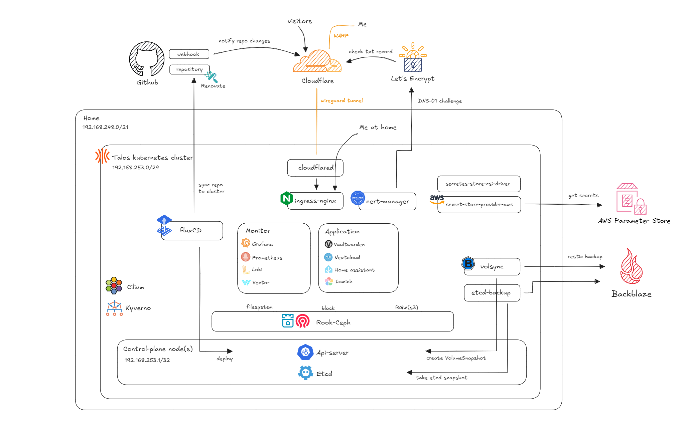
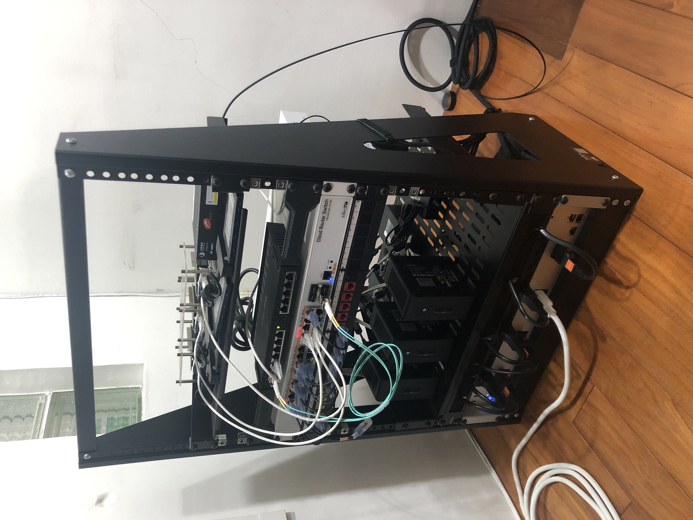

### My Homelab :octocat:

... _progressing with [未来のミュージアム](https://www.youtube.com/watch?v=s8_vqfjYpBg)_ 🎧

&nbsp;&nbsp;
&nbsp;&nbsp;
&nbsp;&nbsp;

&nbsp;&nbsp;
&nbsp;&nbsp;
&nbsp;&nbsp;
&nbsp;&nbsp;
&nbsp;&nbsp;
&nbsp;&nbsp;

---

## 📖 Overview

This is a mono repository for my home infrastructure and Kubernetes cluster. I use [Talos](https://github.com/siderolabs/talos) Kubernetes distribution, and follows the concept Infrastructure as Code (IaC), using the tools like [Flux](https://github.com/fluxcd/flux2), [Terraform](https://github.com/hashicorp/terraform), [Renovate](https://github.com/renovatebot/renovate) and [Github Actions](https://github.com/features/actions).

## Architecture

## 🚢 Technology Stack

|                                                                                                                                                      | Name                                                                                      | Description                                                         |
| :--------------------------------------------------------------------------------------------------------------------------------------------------: | ----------------------------------------------------------------------------------------- | ------------------------------------------------------------------- |
|                                                                                          | [Talos](https://github.com/siderolabs/talos)                                              | Immutable Linux distribution for Kubernetes.                        |
|                                          | [Flux](https://github.com/fluxcd/flux2)                                                   | Gitops tool to reconcile sources from Git repository to Kubernetes. |
|                                    | [Kyverno](https://github.com/kyverno/kyverno)                                             | Kubernetes policy manager.                                          |
|                                      | [Cilium](https://github.com/cilium/cilium)                                                | Advanced networking.                                                |
|                                                                       | [Metallb](https://github.com/metallb/metallb)                                             | IP address announcement and allocation for Kubernetes LoadBalancer. |
|                        | [Cloudflared](https://github.com/cloudflare/cloudflared)                                  | Encrypted tunnel between server and Cloudflare.                     |
|                          | [Cert-manager](https://github.com/cert-manager/cert-manager)                              | Public and private certificate controller.                          |
|                             | [Ingress-nginx](https://github.com/Kubernetes/ingress-nginx)                              | Simple ingress controller.                                          |
|                                          | [Rook-ceph](https://github.com/rook/rook)                                                 | Ceph operator, providing block, object and file storage.            |
|                                                                     | [Volsync](https://github.com/backube/volsync)                                             | Persistent Volume snapshot and backup.                              |
|                                                                    | [CloudNativePG](https://github.com/cloudnative-pg/cloudnative-pg)                         | Postgres operator.                                                  |
|                                                                               | [Grafana LG~~T~~M](https://github.com/grafana)                                            | System monitoring.                                                  |
|  | [Amazon-eks-pod-identity-webhook](https://github.com/aws/amazon-eks-pod-identity-webhook) | ServiceAccount token injection for Pod to access AWS.               |

## ☁️ Cloud Services

| Service       | Usage                                      | Cost            |
| :------------ | :----------------------------------------- | :-------------- |
| Github        | Code repository and automation chores/jobs | Free            |
| JumpCloud     | SSO identity provider                      | Free            |
| Cloudflare    | Domain registrar and tunnel                | $10/year        |
| Backblaze     | S3 bucket for buckup                       | ~$1/month       |
| AWS           | Parameter storage and terraform backend    | Free            |
| Grafana Cloud | External montoring                         | Free            |
| Let's Encrypt | Public certificate authroity               | Free            |
|               |                                            | Total ~$22/year |

## 🔧 Hardware

Click to see the rack

| Device                          | Description                  | Count | RAM                        | Disk                                                                      |
| ------------------------------- | ---------------------------- | ----- | -------------------------- | ------------------------------------------------------------------------- |
| Askey RTF8207W                  | Chunghwa Telecom modem       | 1     |                            |                                                                           |
| Mikrotik RB4011iGS+RM           | Router                       | 1     |                            |                                                                           |
| Mikrotik CRS328-24P-4S+RM       | PoE Switch                   | 1     |                            |                                                                           |
| Raspberry Pi 4B with PoE hat    | Kubernetes control planes    | 1     | 8GB                        | 960GB SSD Micron 5200                                                     |
| Intel NUC11TNHi50L              | Kubernetes worker nodes      | 3     | 16\*2 Mircon CT16G4SFRA32A | 
• OS: 960GB SSD Mircon 5300

• Data: 960GB NVMe Mircon 7450 |
| Ubiquiti Power Distribution Pro | 16p Switched and metered PDU | 1     |                            |                                                                           |

## 🤝 Acknowledgments

Thanks to [Home Operations](https://discord.com/invite/home-operations) Discord community. I always find lots of cool ideas from chats. Also a special thanks to the great [series](https://greg.jeanmart.me/2020/04/13/build-your-very-own-self-hosting-platform-wi/), by Grégoire Jeanmart, which motivate me to start this project.

## 📄 License

Code is under the [MIT License](./LICENSE).
Document and image is avaliable under [CC BY-SA 4.0 License](https://creativecommons.org/licenses/by-sa/4.0/).
