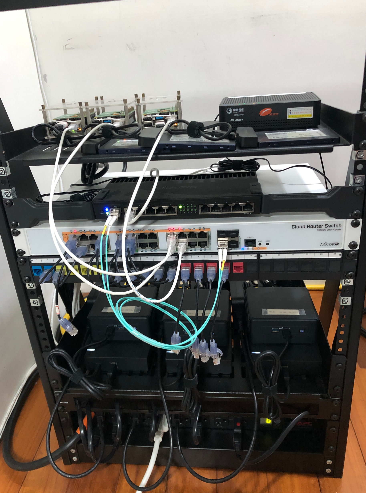

<div align="center">

### My Homelab Repository :octocat:

... _progressed with the song [未来のミュージアム](https://www.youtube.com/watch?v=s8_vqfjYpBg)_ 🎧

</div>

---

## 📖 Overview

This is a mono repository for my home infrastructure and Kubernetes cluster. I use [Talos](https://github.com/siderolabs/talos) Kubernetes distribution, and follows the concept Infrastructure as Code (IaC), using the tools like [Flux](https://github.com/fluxcd/flux2), [Terraform](https://github.com/hashicorp/terraform), [Renovate](https://github.com/renovatebot/renovate) and [Github Actions](https://github.com/features/actions).

## ⛵ Kubernetes

### Core Components

- [Flux](https://github.com/fluxcd/flux2): gitops tool reconcile manifests from Git repository to Kubernetes.
- [Cilium](https://github.com/cilium/cilium): advanced networking.
- [Metallb](https://github.com/metallb/metallb): IP address announcement and allocation for Kubernetes LoadBalancer Service.
- [Cloudflared](https://github.com/cloudflare/cloudflared): encrypted tunnel between server and Cloudflare.
- [Cert-manager](https://github.com/cert-manager/cert-manager): public and private certificate controller.
- [Ingress-nginx](https://github.com/Kubernetes/ingress-nginx): simple ingress controller.
- [Rook-ceph](https://github.com/rook/rook): ceph operator. I use nvme and hdd to provide different performace of block, object and file storage.
- [Volsync](https://github.com/backube/volsync): Persistent Volume snapshot and backup. I use Restic-based backup to Backblaze S3 bucket.
- [CNPG](https://github.com/cloudnative-pg/cloudnative-pg): postgres operator.
- [Grafana LG~~T~~M](https://github.com/grafana): system monitoring stack.
- [Kyverno](https://github.com/kyverno/kyverno): Kubernetes policy manager.
- [Secrets-store-csi-driver](https://github.com/Kubernetes-sigs/secrets-store-csi-driver): mount secret volumes form external providers into a Pod, providing an alternative way to Kubernetes Secret.
- [Amazon-eks-pod-identity-webhook](https://github.com/aws/amazon-eks-pod-identity-webhook): ServiceAccount token injection for Pod to access AWS.

### Flux Reconcile Flow

...

### Networking

...

### Storage

...

### Secrets

Kubernetes secrets are sourced externally from AWS Parameter Store. To provide the namespace separation and reduce etcd secret storage, I put more effort on Kubernetes secret management using secret-store-csi-driver and AWS IRSA:

```
                                                                                                OIDC discovery documents
                                                                                                            ↑
                                                                                                        reference
                                                                                                            |
                                                         ---- 2. exchange the token to AWS credentail ---> AWS STS
secrets-store-csi-driver ---> secrets-store-csi-driver-  ---- 3. get secrets ---> AWS Parameter Store
                                provider-aws
                                    |
                  1. create ServiceAccount token by impersonating workload
                                    ↓
                                 kube-api
```

Secrets-store-csi-driver-provider-aws DaemonSet plays as central manager to the secret fetching flow. Starting from volume mount request, secrets-store-csi-driver-provider-aws will create a ServiceAccount token by impersonating the workload, and try to exchange an AWS credential. AWS STS validate the ServiceAccount token by referencing OIDC discovery documents [s3://amethyst-kubernetes-oidc/.well-known/openid-configuration](https://amethyst-kubernetes-oidc.s3.us-west-2.amazonaws.com/.well-known/openid-configuration), and return a temporary AWS credential. Finally, secrets-store-csi-driver-provider-aws get secrtes from AWS Parameter Store and write secrets to a target hostPath.

Notice that Talos Linux default use ES256 for Kubernetes ServiceAccount token, however [AWS STS only supports token with RS256](https://docs.aws.amazon.com/STS/latest/APIReference/API_AssumeRoleWithWebIdentity.html). We need to generate an RSA key, base64 encode and patch the talos configuration `cluster.serviceAccount.key` on control plane. The [blog](https://www.siderolabs.com/blog/workload-identity-for-Kubernetes-on-gcp) might be helpful.

## ☁️ Cloud Services

| Service       | Usage                                      | Cost            |
| :------------ | :----------------------------------------- | :-------------- |
| Github        | Code repository and automation chores/jobs | Free            |
| JumpCloud     | SSO identity provider                      | Free            |
| Cloudflare    | Domain registrar and tunnel                | $10/year        |
| Backblaze     | S3 bucket for buckup                       | ~$1/month       |
| AWS           | Parameter storage and terraform backend    | Free            |
| Grafana Cloud | External montoring                         | Free            |
| Let's Encrypt | Public certificate authroity               | Free            |
|               |                                            | Total ~$22/year |

## 🔧 Hardware

<details>
<summary>Click to see the rack</summary>

</details>

| Device                           | Description               | Count | RAM                          | Disk                                                                                                             |
| -------------------------------- | ------------------------- | ----- | ---------------------------- | ---------------------------------------------------------------------------------------------------------------- |
| Askey RTF8207W                   | Chunghwa Telecom modem    | 1     |                              |                                                                                                                  |
| Mikrotik<br/>RB4011iGS+RM        | Router                    | 1     |                              |                                                                                                                  |
| Mikrotik<br/>CRS328-24P-4S+RM    | PoE Switch                | 1     |                              |                                                                                                                  |
| Raspberry Pi 4B</br>with PoE hat | Kubernetes worker nodes   | 3     | 8GB                          | 960GB SSD Micron 5200                                                                                            |
| Intel<br/>NUC11TNHi50L           | Kubernetes control planes | 3     | 16-32GB Mircon CT16G4SFRA32A | <div>• OS: 960GB SSD Mircon 5300<div/><div>• Data: 960GB NVMe Mircon 7450, and 4TB HDD Seagate ST4000VN008<div/> |
| APC AP7902                       | 16p Switched PDU          | 1     |                              |                                                                                                                  |

## 🤝 Acknowledgments

Thanks to [Home Operations](https://discord.com/invite/home-operations) Discord community. I always find lots of cool ideas from chats. Also a special thanks to the great [series](https://greg.jeanmart.me/2020/04/13/build-your-very-own-self-hosting-platform-wi/), by Grégoire Jeanmart, which motivate me to start this project.

## 📄 License

See [Licesne](./LICENSE).
