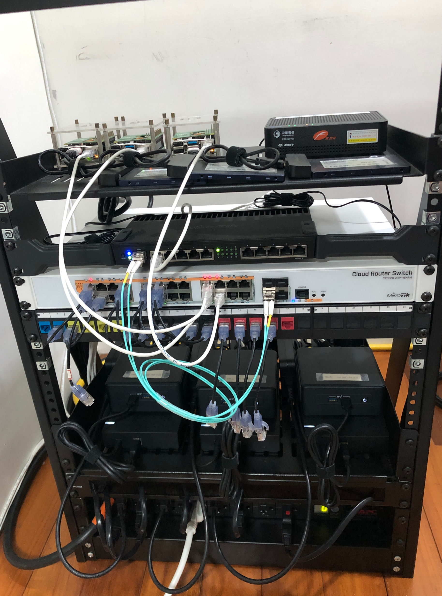

# Amethyst

Amethyst is the infrastructure of my homelab. 

The main purpose of the amethyst project is to build a Kubernetes system to hold my own data, and also provide a free space to learn new tools. I use [Talos Linux](https://github.com/siderolabs/talos) Kubernetes distribution, and follows the concept Infrastructure as Code (IaC), using [Flux](https://github.com/fluxcd/flux2) and [Terraform](https://github.com/hashicorp/terraform) to manage the system. I also try my best to public tuning parameters. Sure, sentative data are encrypted with [sops](https://github.com/getsops/sops) or remotely put on the cloud.

## Directories

```bash
amethyst
  ├── .well-known    # OpenID Connect discovery documents
  ├── docs           # documents and photos
  ├── kubernetes     # In-cluster workloads organize by namespace
  ├── talos          # Talos Linux configurations
  ├── terraform      # Clouds configurations
  └── Taskfile.yaml  # Handy commands
```

## Kubernetes components

- [Talos](https://github.com/siderolabs/talos): Kubernetes distributions for immutable OS.
- [Flux](https://github.com/fluxcd/flux2): gitops tool reconcile manifests from Git repository to Kubernetes.
- [Cilium](https://github.com/cilium/cilium): advanced networking, but I merely use NetworkPolicy.
- [Metallb](https://github.com/metallb/metallb): IP address announcement and allocation for Kubernetes LoadBalancer Service.
- [Cloudflared](https://github.com/cloudflare/cloudflared): encrypted tunnel between server and Cloudflare.
- [Cert-manager](https://github.com/cert-manager/cert-manager): public and private certificate controller.
- [Ingress-nginx](https://github.com/Kubernetes/ingress-nginx): simple ingress controller.
- [Rook Ceph](https://github.com/rook/rook): ceph operator. I use nvme and hdd to provide different performace of block, object, and file storage.
- [Volsync](https://github.com/backube/volsync): Persistent Volume snapshot and backup. I use Restic-based backup to Backblaze S3 bucket.
- [CNPG](https://github.com/cloudnative-pg/cloudnative-pg): postgres operator.
- [Grafana LG~~T~~M](https://github.com/grafana): system monitoring stack.
- [Kyverno](https://github.com/kyverno/kyverno): Kubernetes policy manager.
- [Secret Store CSI driver](https://github.com/Kubernetes-sigs/secrets-store-csi-driver): mount secret volumes form external providers into a Pod, providing an alternative way to Kubernetes Secret.
- [AWS EKS Pod Identity Webhook](https://github.com/aws/amazon-eks-pod-identity-webhook): ServiceAccount token injection for Pod to access AWS.

## Cloud Services

| Service       | Usage                                      | Cost            |
| :------------ | :----------------------------------------- | :-------------- |
| Github        | Code repository and automation chores/jobs | Free            |
| JumpCloud     | SSO identity provider                      | Free            |
| Cloudflare    | Domain registrar and tunnel                | $10/year        |
| Backblaze     | S3 bucket for buckup                       | ~$1/month       |
| AWS           | Parameter storage and terraform backend    | Free            |
| Grafana Cloud | External montoring                         | Free            |
| Let's Encrypt | Public certificate authroity               | Free            |
|               |                                            | Total ~$22/year |

## Hardware

<details>
<summary>Click to see the rack</summary>

</details>

| Device                           | Description             | RAM                          | Disk                                                                                                             | Quantity |
| -------------------------------- | ----------------------- | ---------------------------- | ---------------------------------------------------------------------------------------------------------------- | -------- |
| Mikrotik<br/>RB4011iGS+RM        | Router                  |                              |                                                                                                                  | 1        |
| Mikrotik<br/>CRS328-24P-4S+RM    | PoE Switch              |                              |                                                                                                                  | 1        |
| Intel<br/>NUC11TNHi50L           | Kubernetes master nodes | 16-32GB Mircon CT16G4SFRA32A | <div>• OS: 960GB SSD Mircon 5300<div/><div>• Data: 960GB NVMe Mircon 7450, and 4TB HDD Seagate ST4000VN008<div/> | 3        |
| Raspberry Pi 4B</br>with PoE hat | Kubernetes worker nodes | 8GB                          | 960GB SSD Micron 5200                                                                                            | 3        |
| Ubiquiti U6-lite                 | Wireless AP             |                              |                                                                                                                  | 1        |
| Ubiquiti U6-LR                   | Wireless AP             |                              |                                                                                                                  | 1        |

## Networking

TBD

## Secret Management

Talos secret strings are encrypted using sops. Kubernetes and terraform secrets are sourced externally from AWS Parameter Store.

To provide namespace separation and credential-less environment for applications, I put more effort on Kubernetes secret management following Secret Store CSI driver and AWS IRSA:

```
                                                                                  amethyst OIDC discovery document
                                                                                              ↑
                                                                                          reference
                                                                                              |
                                          ---- 2. exchange the token to AWS credentail ---> AWS STS
Secret Store CSI driver ---> AWS provider ---- 3. get secrets ---> AWS Parameter Store
                                |
              1. create a workload ServiceAccount token
                                ↓
                              kube-api
```

AWS provider for Secret Store CSI driver DaemonSet plays as central manager to ServiceAccount token and secrets. While getting the mount request from Secret Store CSI driver, AWS provider create a ServiceAccount token for the workload, and try to exchange the token to a AWS credential. AWS STS will validate the token by referencing my OIDC discovery document [amethyst/.well-known/openid-configuration](.well-known/openid-configuration), and return a temporary AWS credential. Then AWS provider get secrtes from AWS Parameter Store and write secrets to a target hostPath.

Notice that Talos Linux default use ES256 for Kubernetes ServiceAccount token, however [AWS STS only supports token with RS256](https://docs.aws.amazon.com/STS/latest/APIReference/API_AssumeRoleWithWebIdentity.html). We need to generate an RSA key, base64 encode and patch the talos configuration `cluster.serviceAccount.key` on control plane. The blog may be helpful https://www.siderolabs.com/blog/workload-identity-for-Kubernetes-on-gcp.
